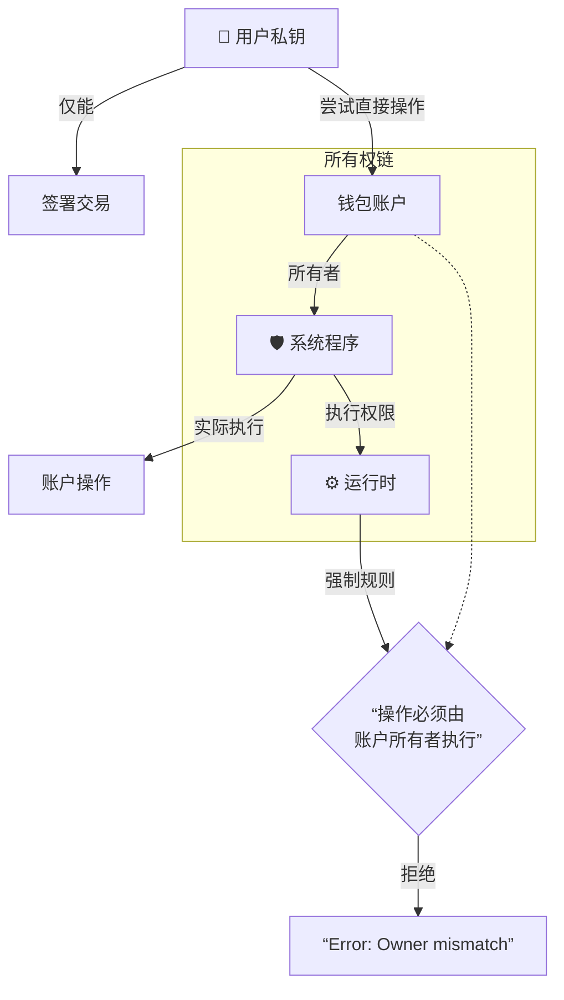
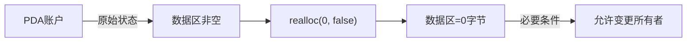
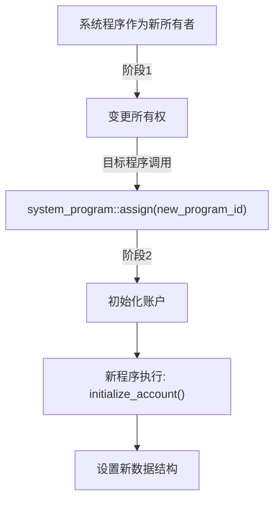

# 1. 账户所有权操作权限题  
> **问题**：Solana 运行时规定只有账户的所有者才能执行哪些关键操作？为什么钱包所有者不能直接修改自己的密钥对账户数据？请结合系统程序的作用解释这种设计的安全性考量。

**考察点**：  
- 所有权基本权限（减少 lamports/写入数据/更改所有者）  
- 系统程序的代理验证机制（私钥签名 → 系统程序执行）  
- 安全设计哲学（运行时隔离用户直接操作）


您的回答部分正确，但需要更精确的技术解释。以下是完整修正版：

### 正确答案解析：
**1. 关键操作权限 (三元组):**  
只有账户所有者才能执行：  
✅ **减少 lamports**（如 SOL 转账支出）  
✅ **写入数据**（修改账户存储内容）  
✅ **更改所有者**（转移账户控制权）  

**2. 用户无法直接操作的根本原因:**  
🔐 **所有权与操作代理分离机制**:  
- 您的密钥对账户（如钱包）所有者是**系统程序**（System Program）而非用户私钥  
- Solana 运行时规定：所有账户操作必须由其**所有者程序**执行  



**3. 系统程序的安全作用:**  
🛡️ **安全三机制**:  
1. **签名验证代理**:  
   ```rust
   // 系统程序执行前的检查
   if !system_program::check(account.owner) {
       return Err(ProgramError::IncorrectProgramId); // 阻止非所有者操作
   }
   ```
2. **操作沙箱化**:  
   - 用户私钥 → 仅用于生成交易签名  
   - 系统程序 → 实际执行增减lamports/写入数据等操作  

3. **运行时强制隔离**:  
   | 操作层级       | 用户权限          | 系统程序权限      |
   |----------------|-------------------|------------------|
   | 读取数据       | ✅ 所有账户       | ✅ 所有账户      |
   | 减少lamports  | ❌ 仅通过系统程序 | ✅ 可操作所属账户 |
   | 写入数据       | ❌ 仅通过系统程序 | ✅ 可操作所属账户 |

**4. 安全设计目的:**  
🔥 **防御方向**              | 💡 **实现方式**  
------------------------------|------------------  
防止恶意程序任意操作账户        | 运行时验证操作发起者是否所有者  
避免用户误操作损坏账户         | 系统程序封装复杂操作（如租金计算）  
确保跨程序交互安全             | PDA只能由其派生程序操作  

### 举个实际场景:
当您转账 SOL 时：  
1. 您签署交易但**不直接操作账户**  
2. 交易中**包含系统程序指令**  
3. 运行时验证：  
   - 发送账户所有者 = 系统程序 ✅  
   - 系统程序验证签名有效性 ✅  
4. 系统程序执行 lamports 增减  

> 这种设计类似银行系统：  
> - 您(用户) = 提供签字授权  
> - 柜员(系统程序) = 执行资金操作  
> - 监控系统(运行时) = 确保仅柜员操作保险柜

# 2. 所有权转移实践题  
> **问题**：现有程序需转移其拥有的 PDA 账户所有权给系统程序。根据文档中的 `change_owner` 示例：  
> (a) 为什么必须在转移前执行 `realloc(0, false)`？  
> (b) 若省略此步骤可能导致何种安全问题？  
> (c) 转移后该账户能否被重新初始化？请说明技术依据。

**考察点**：  
- 所有权转移的前置条件（数据清除必要性）  
- 跨程序数据污染风险  
- Solana 账户生命周期管理


您的回答部分正确，但需要更精准的技术补充。以下是完整解析：

### (a) 为什么必须在转移前执行 `realloc(0, false)`？
✅ **核心原因**：系统程序要求接收的账户必须是**零数据状态**（zero-sized），这是Solana运行时的强制规范：


**技术本质**：
1. 系统程序作为基础所有者，**不解析任何账户数据**
2. 非零数据状态会导致运行时拒绝所有权变更：
   ```rust
   // 运行时检查代码逻辑
   if target_account.data_len() > 0 {
       return Err(ProgramError::AccountDataSizeChanged); // 拒绝变更
   }
   ```

---

### (b) 省略步骤的安全风险
🔥 **三重安全隐患**：
1. **数据泄露漏洞**  
   - 未清除的数据可能包含敏感信息（如私钥片段）
   - 攻击者可通过读取残留数据重建权限

2. **跨程序污染**  
   ```mermaid
   flowchart TD
     A[恶意程序] -->|访问残留数据| B[解析旧数据结构]
     B --> C[伪造操作指令]
     C --> D[非法提取资金]
   ```

3. **所有者混淆攻击**  
   | 攻击类型        | 原理                     | 后果示例               |
   |----------------|--------------------------|----------------------|
   | 重放攻击        | 复用旧数据签名           | 盗取账户剩余资金       |
   | 所有权欺骗      | 伪装成原程序操作账户     | 非法更改账户属性       |

---

### (c) 转移后能否重新初始化？
✅ **可以，但需满足两阶段条件**：


**技术依据**：
1. **运行时规则**：  
   - 系统程序作为所有者时，允许其他程序通过CPI调用`assign()`变更所有者
   ```
    📜 Solana文档: 
   系统程序管理的账户可通过assign指令转移所有者
   ```

2. **重新初始化前提**：  
   - 新程序必须是BPFLoader兼容的程序
   - 必须提供新程序的签名授权
   - 账户仍需保持零数据状态（否则需再次`realloc(0)`）

> 典型用例：将PDA从弃用程序迁移至升级版程序，实现无缝升级。

需要具体代码示例说明重新初始化过程吗？


