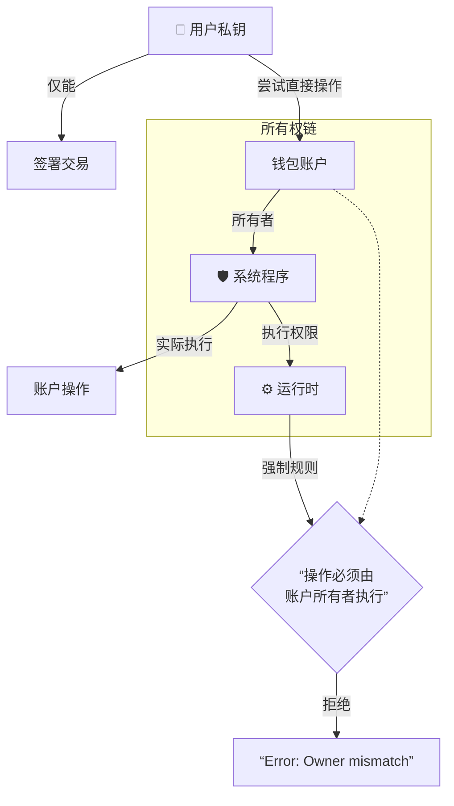

# 1. 账户所有权操作权限题  
> **问题**：Solana 运行时规定只有账户的所有者才能执行哪些关键操作？为什么钱包所有者不能直接修改自己的密钥对账户数据？请结合系统程序的作用解释这种设计的安全性考量。

**考察点**：  
- 所有权基本权限（减少 lamports/写入数据/更改所有者）  
- 系统程序的代理验证机制（私钥签名 → 系统程序执行）  
- 安全设计哲学（运行时隔离用户直接操作）


您的回答部分正确，但需要更精确的技术解释。以下是完整修正版：

### 正确答案解析：
**1. 关键操作权限 (三元组):**  
只有账户所有者才能执行：  
✅ **减少 lamports**（如 SOL 转账支出）  
✅ **写入数据**（修改账户存储内容）  
✅ **更改所有者**（转移账户控制权）  

**2. 用户无法直接操作的根本原因:**  
🔐 **所有权与操作代理分离机制**:  
- 您的密钥对账户（如钱包）所有者是**系统程序**（System Program）而非用户私钥  
- Solana 运行时规定：所有账户操作必须由其**所有者程序**执行  



**3. 系统程序的安全作用:**  
🛡️ **安全三机制**:  
1. **签名验证代理**:  
   ```rust
   // 系统程序执行前的检查
   if !system_program::check(account.owner) {
       return Err(ProgramError::IncorrectProgramId); // 阻止非所有者操作
   }
   ```
2. **操作沙箱化**:  
   - 用户私钥 → 仅用于生成交易签名  
   - 系统程序 → 实际执行增减lamports/写入数据等操作  

3. **运行时强制隔离**:  
   | 操作层级       | 用户权限          | 系统程序权限      |
   |----------------|-------------------|------------------|
   | 读取数据       | ✅ 所有账户       | ✅ 所有账户      |
   | 减少lamports  | ❌ 仅通过系统程序 | ✅ 可操作所属账户 |
   | 写入数据       | ❌ 仅通过系统程序 | ✅ 可操作所属账户 |

**4. 安全设计目的:**  
🔥 **防御方向**              | 💡 **实现方式**  
------------------------------|------------------  
防止恶意程序任意操作账户        | 运行时验证操作发起者是否所有者  
避免用户误操作损坏账户         | 系统程序封装复杂操作（如租金计算）  
确保跨程序交互安全             | PDA只能由其派生程序操作  

### 举个实际场景:
当您转账 SOL 时：  
1. 您签署交易但**不直接操作账户**  
2. 交易中**包含系统程序指令**  
3. 运行时验证：  
   - 发送账户所有者 = 系统程序 ✅  
   - 系统程序验证签名有效性 ✅  
4. 系统程序执行 lamports 增减  

> 这种设计类似银行系统：  
> - 您(用户) = 提供签字授权  
> - 柜员(系统程序) = 执行资金操作  
> - 监控系统(运行时) = 确保仅柜员操作保险柜
